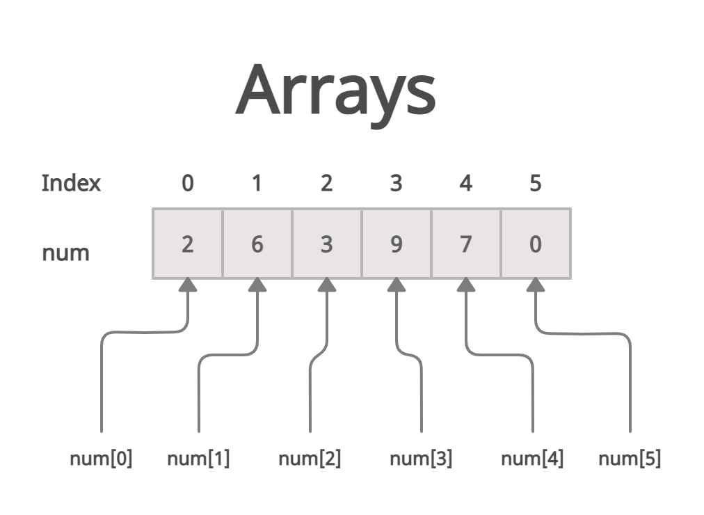

# Script Arrays - Array Exercises

## Table of Contents

- [What are arrays?](#what-are-arrays)
- [Array Basics](#array-basics)
- [Loops with Arrays](#loops-with-arrays)
- [Modifying vs Creating New](#modifying-vs-creating-new-array)
- [Debugging Tips](#-debugging-tips)

### What are arrays?
<details>
    <summary>Definition</summary>

Arrays are data structures that can store multiple values of the same type.

The individual elements are accessible via an index. It is important to note that the index starts at 0.

Visualization of an array:



#### Key Properties:
- Arrays have a fixed size
- Indexing starts at 0
- All elements have the same data type (at least in Java)
- Access via index: array[0] gives the first element (note the index), array[1] gives the second element, etc.

</details>

### Array Basics
<details>
    <summary>Array Creation and Access</summary>

Array creation:
```java
// Variant 1: Specify size
int[] numbers = new int[5]; // Array with 5 elements (all 0) 

// Variant 2: Initialize with values
int[] numbers = {1, 2, 3, 4, 5}; // The array length matches the number of values

// Variant 3: new with values
int[] numbers = new int[]{1, 2, 3, 4, 5};
```

Array access:
```java 
int[] array = {10, 20, 30};
System.out.println(array[0]); // Output: 10
System.out.println(array.length); // Output: 3 (length of the array)

array[1] = 99; // Change value
// Array is now: {10, 99, 30}
```
Pay attention to array boundaries:
```java
int[] array = {1, 2, 3};
System.out.println(array[3]); // Error!
// array\[3\] would throw an IndexOutOfBoundsException because index 3 does not exist!
// Valid indices: 0, 1, 2
```

</details>

### Loops with Arrays
<details>
    <summary>for loop vs for-each loop</summary>

Classic for loop:

```java
int[] numbers = {10, 20, 30, 40, 50};

for (int i = 0; i < numbers.length; i++) {
System.out.print("Index " + i + ": " + numbers[i]);
}
```

Advantages: Access to index, can modify array

for-each loop (enhanced for loop):

```java 
int[] numbers = {10, 20, 30, 40, 50};

for (int number : numbers) {
System.out.println("Value: " + number);
}
```

Advantages: Easier to write, less error-prone

#### When to use which loop?
- for-each: When you only need the values (read-only)
- classic for: When you need the index or want to modify the array

</details>

### Modifying vs. Creating a New Array

<details>
    <summary>Important difference in array operations</summary>

There is an important difference between modifying (changing the original array) and manipulating (creating a new array):

🔄 Modifying - Change the original array:

```java
// Method directly modifies the passed array
public void reverse(int[] numbers) {
    // The SAME array is modified here
    for (int i = 0; i < numbers.length / 2; i++) {
        int temp = numbers[i];
        numbers[i] = numbers[numbers.length - 1 - i];
        numbers[numbers.length - 1 - i] = temp;
    }
    // No return needed - the original is changed!
}

// Usage:
int[] myArray = {1, 2, 3, 4, 5};
reverse(myArray);
System.out.println(Arrays.toString(myArray)); // [5, 4, 3, 2, 1]
```

🆕 Create a new array - original remains unchanged:

```java
// Method creates a NEW array
public int[] filterEven(int[] numbers) {
// Here a completely new array is created
List<Integer> evenNumbers = new ArrayList<>();
for (int num : numbers) {
if (num % 2 == 0) {
evenNumbers.add(num);
}
}
return evenNumbers.stream().mapToInt(i -> i).toArray();
// Original array remains unchanged!
}

// Usage:
int[] myArray = {1, 2, 3, 4, 5};
int[] evenArray = filterEven(myArray);
System.out.println(Arrays.toString(myArray));    // [1, 2, 3, 4, 5] (unchanged!)
System.out.println(Arrays.toString(evenArray));  // [2, 4]
```

#### 🎯 When to use which approach?
Use modification when:
- ✅ You want to save memory
- ✅ The original array is no longer needed
- ✅ Performance is important (no array creation)
- ✅ Examples: reverse(), multiplyBy()

Create a new array when:
- ✅ The original should be preserved
- ✅ The size changes (filter operations)
- ✅ Different data types in the result
- ✅ Examples: filterEven(), concatenate(), removeDuplicates()

⚠️ Important note:
Arrays in Java are passed by reference. This means that the method accesses the same array object as the caller. Changes in the method therefore affect the original array!
</details>

### 🎯 Debugging-Tipps
<details>
    <summary>Häufige Fehler und wie man sie vermeidet</summary>
1. IndexOutOfBoundsException:

```java
java// ❌ Wrong
for (int i = 0; i <= array.length; i++) // <= is wrong!

// ✅ Correct  
for (int i = 0; i < array.length; i++) // or 
for (int i = 0; i <= array.length - 1; i++)
```

2. NullPointerException:

```java
// ❌ Not checking for null array
   public int sum(int[] numbers) {
   int sum = 0;
   for (int num : numbers) { // Error if numbers == null
   sum += num;
   }
   return sum;
   }

// ✅ Add null check
public int sum(int[] numbers) {
if (numbers == null) return 0;
// ... rest of the method
}
```

3. Forgot empty array:
```java
// ❌ Not handling empty array
public int findMax(int[] numbers) {
    int max = numbers[0]; // Error with empty array!
// ...
}

// ✅ Check for empty array
public int findMax(int[] numbers) {
if (numbers.length == 0) return Integer.MIN_VALUE;
int max = numbers[0];
// ...
}
```
</details>