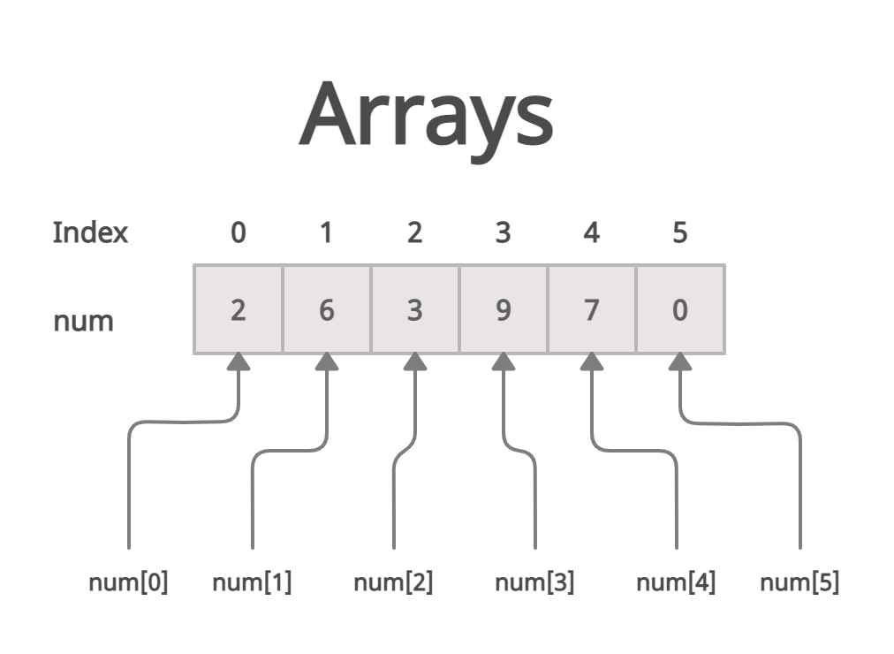

# Skript Arrays - ArrayAufgaben

## Inhaltsverzeichnis

- [Was sind Arrays?](#was-sind-arrays)
- [Array-Grundlagen](#array-grundlagen)
- [Schleifen mit Arrays](#schleifen-mit-arrays)
- [Modifizieren vs Neu erstellung](#modifizieren-vs-neues-array-erstellen)
- [Debugging Tipps](#-debugging-tipps)

### Was sind Arrays?
<details>
    <summary>Definition</summary>

Arrays sind Datenstrukturen, die mehrere Werte des gleichen Typs speichern können.

Die jeweiligen Elemente sind über einen Index zugreifbar. wichtig ist hierbei das der Index bei 0 beginnt.

Visualisierung eines Arrays:



.#### Wichtige Eigenschaften:
- Arrays haben eine feste Größe
- Indizierung beginnt bei 0
- Alle Elemente haben den gleichen Datentyp (Zumindest in Java so)
- Zugriff über Index: array[0] gibt das erste Element (man beachte index), array[1] gibt das zweite Element, etc.

</details>

### Array-Grundlagen
<details>
    <summary>Array-Erstellung und Zugriff</summary>

Array erstellen:
```java
java// Variante 1: Größe angeben
int[] numbers = new int[5]; // Array mit 5 Elementen (alle 0) 

// Variante 2: Mit Werten initialisieren
int[] numbers = {1, 2, 3, 4, 5}; // Das Array ist dann so lange wie die Anzahl der Werte

// Variante 3: new mit Werten
int[] numbers = new int[]{1, 2, 3, 4, 5};
```

Array-Zugriff:
```java 
int[] array = {10, 20, 30};
System.out.println(array[0]); // Ausgabe: 10
System.out.println(array.length); // Ausgabe: 3 (Länge des Arrays)

array[1] = 99; // Wert ändern
// Array ist jetzt: {10, 99, 30}
```

Array-Grenzen beachten:
```java
javaint[] array = {1, 2, 3};
System.out.println(array[3]); // Fehler!
// array[3] würde einen IndexOutOfBoundsException werfen da der index 3 nicht existiert!
// Gültige Indizes: 0, 1, 2
```

</details>

### Schleifen mit Arrays
<details>
    <summary>for-Schleife vs for-each-Schleife</summary>

Klassische for-Schleife:

```java
int[] numbers = {10, 20, 30, 40, 50};

for (int i = 0; i < numbers.length; i++) {
System.out.print("Index " + i + ": " + numbers[i]);
}
```

Vorteile: Zugriff auf Index, kann Array modifizieren

for-each-Schleife (enhanced for loop):

```java 
int[] numbers = {10, 20, 30, 40, 50};

for (int number : numbers) {
System.out.println("Wert: " + number);
}
```

Vorteile: Einfacher zu schreiben, weniger fehleranfällig

#### Wann welche Schleife?
- for-each: Wenn du nur die Werte brauchst (lesen)
- klassische for: Wenn du den Index brauchst oder das Array ändern willst

</details>

### Modifizieren vs. Neues Array erstellen

<details>
    <summary>Wichtiger Unterschied bei Array-Operationen</summary>

Es gibt einen wichtigen Unterschied zwischen Modifizieren (das ursprüngliche Array ändern) und Manipulieren (ein neues Array erstellen):

🔄 Modifizieren - Ursprüngliches Array ändern:

```java
// Methode ändert das übergebene Array direkt
public void reverse(int[] numbers) {
    // Hier wird das GLEICHE Array verändert
    for (int i = 0; i < numbers.length / 2; i++) {
        int temp = numbers[i];
        numbers[i] = numbers[numbers.length - 1 - i];
        numbers[numbers.length - 1 - i] = temp;
    }
    // Kein return nötig - das Original ist geändert!
}

// Verwendung:
int[] myArray = {1, 2, 3, 4, 5};
reverse(myArray);
System.out.println(Arrays.toString(myArray)); // [5, 4, 3, 2, 1]
```

🆕 Neues Array erstellen - Original bleibt unverändert:

```java
// Methode erstellt ein NEUES Array
public int[] filterEven(int[] numbers) {
// Hier wird ein komplett neues Array erstellt
List<Integer> evenNumbers = new ArrayList<>();
for (int num : numbers) {
if (num % 2 == 0) {
evenNumbers.add(num);
}
}
return evenNumbers.stream().mapToInt(i -> i).toArray();
// Original Array bleibt unverändert!
}

// Verwendung:
int[] myArray = {1, 2, 3, 4, 5};
int[] evenArray = filterEven(myArray);
System.out.println(Arrays.toString(myArray));    // [1, 2, 3, 4, 5] (unverändert!)
System.out.println(Arrays.toString(evenArray));  // [2, 4]
```

#### 🎯 Wann welcher Ansatz?
Modifizieren verwenden wenn:
- ✅ Du Speicher sparen willst
- ✅ Das ursprüngliche Array nicht mehr gebraucht wird
- ✅ Performance wichtig ist (keine Array-Erstellung)
- ✅ Beispiele: reverse(), multiplyBy()

Neues Array erstellen wenn:
- ✅ Das Original erhalten bleiben soll
- ✅ Die Größe sich ändert (Filter-Operationen)
- ✅ Verschiedene Datentypen im Ergebnis
- ✅ Beispiele: filterEven(), concatenate(), removeDuplicates()

⚠️ Wichtiger Hinweis:
Arrays in Java werden als Referenz übergeben. Das bedeutet, dass die Methode auf das gleiche Array-Objekt zugreift wie der Aufrufer. Änderungen in der Methode wirken sich daher auf das ursprüngliche Array aus!

</details>

### 🎯 Debugging-Tipps
<details>
    <summary>Häufige Fehler und wie man sie vermeidet</summary>
1. IndexOutOfBoundsException:

```java
java// ❌ Falsch
for (int i = 0; i <= array.length; i++) // <= ist falsch!

// ✅ Richtig  
for (int i = 0; i < array.length; i++) // oder 
for (int i = 0; i <= array.length - 1; i++)
```

2. NullPointerException:

```java
// ❌ Null-Array nicht prüfen
   public int sum(int[] numbers) {
   int sum = 0;
   for (int num : numbers) { // Fehler wenn numbers == null
   sum += num;
   }
   return sum;
   }

// ✅ Null-Check hinzufügen
public int sum(int[] numbers) {
if (numbers == null) return 0;
// ... rest der Methode
}
```

3. Leeres Array vergessen:
```java
// ❌ Leeres Array nicht behandeln
public int findMax(int[] numbers) {
int max = numbers[0]; // Fehler bei leerem Array!
// ...
}

// ✅ Leeres Array prüfen
public int findMax(int[] numbers) {
if (numbers.length == 0) return Integer.MIN_VALUE;
int max = numbers[0];
// ...
}
```
</details>