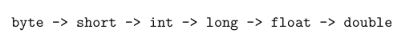

# Script - Linear Programs

## Table of Contents

- [Output to the Console](#output-of-texts)
- [Arithmetic Operations](#arithmetic-operations)
- [Concatenating Strings](#concatenation-of-strings)
- [Calling Methods](#calling-methods-within-a-class)
- [Converting Data Types](#converting-data-types)
- [Arithmetic Operations with boolean](#arithmetic-operations-with-boolean)

### We can output texts to the console

<details>
    <summary>Output of Texts</summary>
We can output texts using `System.out.println();`

```java
System.out.println("I love Java"); // Would output "I love Java"
```

</details>

### Arithmetic Operations

<details>
    <summary>Arithmetic Operations</summary>

In Java, there are various arithmetic operations

| Type of Operation                                                                 | Symbol in Java |
|---------------------------------------------------------------------------|-----------------|
| Plus                                                                      | +               |
| Minus                                                                     | -               |
| Multiply                                                                       | *               |
| Divide (Important: with int, always rounded down) | /               |
| [Modulo](https://meinstein.ch/math/die-modulo-rechnung-einfach-erklaert/) | %               |
| Bitwise Left Shift                                                | <<              |
| Bitwise Right Shift                                               | \>>             |
| Increment (Increase by one)                                              | ++              |
| Decrement (Decrease by one)                                            | --              |

Example:

```java
10 + 5; // Results in 15
10 - 5; // Results in 5
10 * 5; // Results in 50
10 / 4; // Results in 2
10.0 / 2; // Results in 5.0
10 % 3; // Results in 1
```

</details>

### Concatenation of Strings

<details>
    <summary>Concatenation</summary>

Concatenation means joining strings (character chains) together

```java
String name = "Max";
String greeting = "Hello " + name; // Results in "Hello Max"
```

A more efficient way to concatenate strings will follow
</details>

### Calling Methods within a Class

<details>
    <summary>Calling Methods</summary>

Methods are small blocks of code that perform a specific task. In Java, we can call them using the method name and parentheses.

In the following example, we call the method `myMethod` within the class `MyClass`.
```java
public class MyClass {
    public static void myMethod() {
        System.out.println("Hello World");
    }

    public void callMyMethod(){
        myMethod();
    }
}
```
</details>

### Converting Data Types
<details>
    <summary>Converting Data Types</summary>

In Java, there are different data types. Sometimes it is necessary to convert one data type into another.

There is a hierarchy of data types. If you convert upwards in the hierarchy, it is done automatically. If you convert downwards, you must do it explicitly, and values may be lost.



| From   | To     | Example                                |
|--------|--------|----------------------------------------|
| int    | double | double d = (double) 5;                 |
| double | int    | int i = 5.99;                          |
| String | int    | int i = Integer.parseInt("5");         |
| String | double | double d = Double.parseDouble("5.99"); |
| int    | String | String s = Integer.toString(5);        |
| double | String | String s = Double.toString(5.99);      |

</details>

### Arithmetic Operations with boolean
<details>
    <summary>Arithmetic Operations with boolean</summary>

Booleans are values that can only be true or false.

There are different operations for booleans

| Type of Operation                                                 | Symbol in Java |
|-------------------------------------------------------------------|----------------|
| AND                                                               | &&             |
| OR                                                                | \|\|           |
| NOT                                                               | !              |
| [XOR](https://www.elektronik-kompendium.de/sites/dig/0205186.htm) | ^              |

Example:

```java
true && false; // Results in false
true || false; // Results in true
!true; // Results in false
true ^ false; // Results in true
```
</details>


